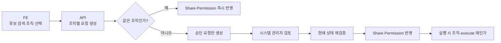

---
{
  "id": "cross-org-sharing",
  "order": 2,
  "published": true,
  "title": "타 조직 Agent 공유 — 승인·실행·회수 경계",
  "category": "fullstack",
  "badge": "FE + BE 직접 구현 · 권한",
  "stack": [
    "Next.js",
    "React",
    "TypeScript",
    "Go",
    "MongoDB",
    "Outbox"
  ],
  "metrics": [
    {
      "label": "관련 테스트",
      "value": "50/50 통과",
      "note": "단위 28개 · 통합 빌드 22개"
    },
    {
      "label": "승인 전 타 조직 권한",
      "value": "0건",
      "note": "권한 정확성 검증"
    },
    {
      "label": "기존 세션 수렴",
      "value": "101개 → 100+1",
      "note": "중복 작업·오래된 설정 덮어쓰기 0건"
    }
  ],
  "layers": [
    "FE 직접",
    "BE 공유·재인가 직접",
    "Outbox 수렴 설계"
  ],
  "summary": "공유를 사용자·대상 조직·공유자 경로로 식별하고, 승인 순간과 5개 실행 경로에서 현재 권한을 재검증했습니다. 기존 세션은 Outbox로 분할 수렴합니다.",
  "measurement": "권한 정확성·반복 실행 안전성·최신 버전 보호를 검증했습니다. 운영 응답시간 분포와 대규모 수렴 시간은 미측정입니다."
}
---

# 다중 조직 Agent 공유 권한 경계

**Next.js·React·TypeScript · Go·MongoDB · 승인 워크플로우 · Outbox**

### S — 한 사용자가 여러 조직 자격으로 Agent를 공유받을 수 있었다

사용자 A가 조직 X와 조직 Y에 동시에 소속된 상황에서 같은 Agent를 각 조직 자격으로 공유받을 수 있었습니다. 그러나 기존 구조는 사용자 ID만 저장했기 때문에 두 공유를 하나처럼 취급했습니다.

- 어느 조직 자격으로 공유받았는지 구분하기 어려움
- 조직 X 경로를 유지하면서 조직 Y 경로만 회수하기 어려움
- 같은 조직 공유와 승인이 필요한 타 조직 공유를 분리하기 어려움
- 실행 요청이 어느 조직 경로의 권한인지 판단하기 어려움

> 사용자에게 권한이 있다는 사실만으로는 부족했습니다. **어떤 조직에서, 누가 만든 경로로 권한을 받았는지**까지 식별해야 잘못된 승인·실행·회수를 막을 수 있었습니다.

### T — 사용 편의는 유지하고 조직 경계는 강화

다음 조건을 동시에 만족하는 공유 모델이 필요했습니다.

1. 같은 조직 공유는 기존처럼 즉시 사용할 수 있어야 함
2. 타 조직 공유는 승인 전까지 접근 권한이 생기면 안 됨
3. 다중 소속 사용자의 조직별 공유를 독립적으로 관리해야 함
4. 대상 조직과 공유자가 일치하는 경로만 회수해야 함
5. 타 조직 수신자에게 재공유 권한을 부여하지 않아야 함

### A — 사용자 × 대상 조직 × 공유자 경로로 재설계

#### 왜 공유자까지 경로에 포함했는가

| 경로 모델 | 남는 문제 | 판단 |
|---|---|---|
| 사용자 | 다중 조직 자격을 구분할 수 없음 | 제외 |
| 사용자 + 대상 조직 | 누가 만든 공유인지 알 수 없어 정확한 회수와 소유권 판단이 모호함 | 보완 필요 |
| 사용자 + 대상 조직 + 공유자 | 조직별 승인·실행·회수 경로를 독립적으로 식별 가능 | 선택 |

#### 핵심 기술 결정

| 기술 경계 | 적용 방식 | 해결한 문제 |
|---|---|---|
| 권한 식별 | 사용자·대상 조직·공유자를 하나의 공유 경로로 관리 | 다중 조직 권한 충돌 방지 |
| 권한 발급 | 같은 조직은 즉시 반영하고 타 조직은 승인 요청만 생성 | 승인 전 접근 권한 생성 차단 |
| 데이터 일관성 | 승인 시 현재 상태를 다시 확인하고 팀·조직 대상은 Share·Permission·Outbox를 연결 | 부분 반영과 오래된 상태 승인 방지 |
| 실행 권한 | 5개 실행 경로에서 현재 조직 관계와 정확한 공유 경로를 다시 확인 | 회수되거나 무효가 된 권한의 재사용 차단 |

#### Before → After

| Before | After |
|---|---|
| Agent → 사용자 | Agent → 사용자 + 대상 조직 + 공유자 |
| 공유받은 조직 구분 불가 | 조직별 권한 경로 독립 관리 |
| 같은 조직과 타 조직 정책 혼재 | 같은 조직은 즉시, 타 조직은 승인 후 반영 |
| 특정 공유 경로만 회수하기 어려움 | 정확한 경로만 선택적으로 회수 |

#### 담당 범위

- **Frontend:** 조직별 대상 선택, 즉시 공유·승인 대기 상태 분리, 오래된 비동기 응답 폐기
- **Backend:** 공유 경로 모델, 승인 재검증, 정확한 경로 회수, 실행 시점 재인가
- **검증:** 단위·MongoDB 통합 테스트 실행, 혼합 요청·중복 실행·오래된 작업 재현

---

# 승인 순간부터 실제 실행까지 조직 경계 재검증

### A — 화면 선택부터 권한 수렴까지 연결

#### Frontend — 검색 상태와 권한 상태 분리

- 조직·팀 필터는 후보 검색에만 사용하고 선택한 사용자의 실제 조직 범위는 별도로 조회
- 다중 소속 사용자는 선택한 조직마다 별도 요청으로 변환
- `shares`는 즉시 사용 가능한 공유, `pending_requests`는 아직 접근할 수 없는 승인 대기로 분리
- 대체 조직 경로가 승인되기 전에는 기존 접근을 유지하고, 실패 시 최신 서버 상태를 다시 조회

#### Backend — 승인 시 7단계 재검증

1. Agent의 현재 소유 조직
2. 요청자의 원본 조직 활성 소속
3. 요청자의 현재 `share` 권한
4. 대상 사용자의 대상 조직 활성 소속
5. 두 조직의 활성 공유 관계
6. Agent 리소스 여부
7. 타 조직 권한이 `read`·`execute`로 제한됐는지 확인

승인 당시 저장된 요청만 믿지 않고 현재 관계를 다시 확인합니다. 승인 뒤에도 세션 생성·채팅·스트리밍·API Key 연결·한톡 실행의 5개 경로에서 현재 조직 관계, 정확한 공유 경로, `execute` 권한을 다시 확인합니다.

#### 기존 세션 100개 단위 수렴과 오래된 작업 차단

타 조직에 공유된 Agent는 공유 권한뿐 아니라 승인된 설정 버전도 일관돼야 합니다.

- 변경 승인 대기 중에는 마지막 승인본을 유지하고 `request_pending`(추가 수정을 막는 승인 대기 상태)으로 새 수정 요청 차단
- 승인 후 새 세션은 즉시 새 설정을 사용하고 기존 세션은 ID 순서로 100개씩 갱신
- Outbox(실패해도 다시 처리할 후속 작업 기록)에 다음 처리 위치와 Agent 수정 시각 저장
- 현재 수정 시각과 다른 이전 작업은 적용할 내용이 없는 정상 완료로 처리
- 세션 반영과 Agent 완료 표식을 같은 트랜잭션에 기록해 새 승인과 이전 작업이 겹치면 이전 커밋을 거부
- 일시적인 데이터베이스 장애처럼 회복 가능한 실패만 재시도

#### 장애를 통해 보완한 경계

| 현상 | 원인 | 보완 |
|---|---|---|
| 관련 없는 공유 변경에도 409 충돌 | Agent 전체 수정 시각을 비교 | 승인 대상의 정확한 경로와 권한 상태만 비교 |
| 팀·조직 공유 회수에서 404 | 대상 조직이 빠져 정확한 경로를 찾지 못함 | 생성과 회수에 동일한 경로 규칙 적용 |
| 팀 공유 수신자의 추가 권한 요청이 403이거나 승인함에서 누락 | 직접 사용자 공유만 관계로 인정하고 리소스 소유자 중심으로 승인자를 배정 | 조직·팀 공유 경로를 확인하고 승인 가능한 관리자에게 배정한 뒤 승인 시점에 권한 재검증 |

### R — 권한 정확성·멱등성·최신 버전 보호 검증

측정일: 2026-09-02

환경: Go 1.26.5 · MongoDB 7.0 · Testcontainers

| 검증 시나리오 | 결과 |
|---|---|
| 관련 테스트 | **50/50 통과** — 단위 28개, 통합 빌드 22개(MongoDB 경로 21개) |
| Agent 혼합 공유 요청 | 1회 요청에서 같은 조직 즉시 공유 1건 + 타 조직 승인 대기 1건 |
| Session 혼합 공유 차단 | 승인 요청·공유·권한 쓰기 모두 0건 |
| 기존 세션 101개 수렴 | 첫 묶음 100개 + 후속 묶음 1개, 후속 작업 중복 생성 0건 |
| 동일 작업 재실행 | 설정 수정 시각 변화 0건 |
| V2 승인 후 V1 작업 재실행 | V2 설정 유지, 오래된 작업의 덮어쓰기 0건 |
| 중복 Agent 설정 발견 | 기존 Session 변경 0건, 완료 표식 기록 0건 |
| 리소스 조직 조회 실패 | 미존재는 404, 일시적 장애는 5xx로 차단 |

> **결과:** 같은 조직의 즉시 공유 사용성은 유지하면서 승인 전 타 조직 권한 생성을 0건으로 제한했습니다. 관련 테스트 50개로 승인·실행·회수 경계를 검증했고, 101개 기존 세션을 100+1로 분할 수렴시키면서 중복·오래된 작업의 최신 설정 덮어쓰기 0건을 확인했습니다.

### 측정 경계

이번 검증은 권한 정확성·반복 실행 안전성·최신 버전 보호를 측정했습니다. 로컬 테스트 실행 시간은 운영 API 응답 속도나 대규모 조직의 전체 수렴 시간을 대표하지 않으므로 성능 개선값으로 사용하지 않습니다. 운영과 같은 데이터 규모·동시성·네트워크 조건에서 부하 테스트를 수행하기 전까지 p50·p95와 1,000명 이상 수렴 시간은 미측정으로 구분합니다.
